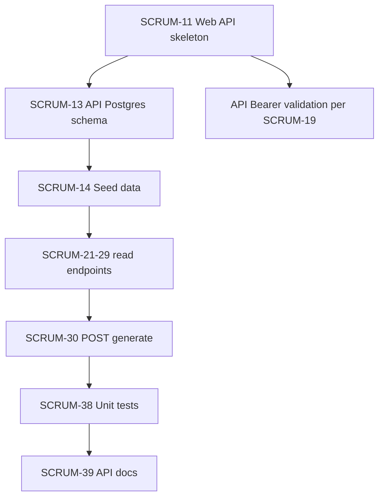

# API Server + API DB: Jira backlog (SCRUM-10–41)

Source: Jira project [LOTR Board Games](https://lotrbg.atlassian.net/jira/software/projects/SCRUM/boards/1) (issues fetched March 30, 2026). Architecture matches [SPEC.md](../../SPEC.md): **Frontend → Web Server (MVC) → API Server (Web API)**; API owns game PostgreSQL (classes, abilities, races, stats, species, premades).

---

## Tickets that are **your** primary ownership (API Server + API DB)

These are explicitly “API Server” or API PostgreSQL work:

| Order hint | Key | Summary |
|------------|-----|---------|
| 1 | [SCRUM-11](https://lotrbg.atlassian.net/browse/SCRUM-11) | Initialize C# Web API project (separate port, skeleton `GET /health` 200) |
| 2 | [SCRUM-13](https://lotrbg.atlassian.net/browse/SCRUM-13) | Set up API Server PostgreSQL database (6 tables per spec) |
| 3 | [SCRUM-14](https://lotrbg.atlassian.net/browse/SCRUM-14) | Seed API database with default LotR data (Ranger/Mage premades + related rows, idempotent seed) |
| — | [SCRUM-21](https://lotrbg.atlassian.net/browse/SCRUM-21) | `GET /class/{id}` |
| — | [SCRUM-22](https://lotrbg.atlassian.net/browse/SCRUM-22) | `GET /stats` |
| — | [SCRUM-23](https://lotrbg.atlassian.net/browse/SCRUM-23) | `GET /health` (game **character health** data per spec — not infra liveness) |
| — | [SCRUM-24](https://lotrbg.atlassian.net/browse/SCRUM-24) | `GET /strength` |
| — | [SCRUM-25](https://lotrbg.atlassian.net/browse/SCRUM-25) | `GET /abilities` |
| — | [SCRUM-26](https://lotrbg.atlassian.net/browse/SCRUM-26) | `GET /race` |
| — | [SCRUM-27](https://lotrbg.atlassian.net/browse/SCRUM-27) | `GET /species` |
| — | [SCRUM-28](https://lotrbg.atlassian.net/browse/SCRUM-28) | `GET /premades` |
| — | [SCRUM-29](https://lotrbg.atlassian.net/browse/SCRUM-29) | `GET /names` |
| — | [SCRUM-30](https://lotrbg.atlassian.net/browse/SCRUM-30) | `POST /generate` |
| Late | [SCRUM-38](https://lotrbg.atlassian.net/browse/SCRUM-38) | Write unit tests for all 10 API endpoints |
| Late | [SCRUM-39](https://lotrbg.atlassian.net/browse/SCRUM-39) | Document all 10 API endpoints |

**Count:** 14 tickets are core API/DB (11, 13, 14, 21–30, 38, 39).

---

## **Shared / coordination** (you touch part of it)

| Key | Why shared |
|-----|------------|
| [SCRUM-15](https://lotrbg.atlassian.net/browse/SCRUM-15) | Both servers run locally without port conflicts + README. You ensure API port/config is documented and runs beside the web server. |
| [SCRUM-19](https://lotrbg.atlassian.net/browse/SCRUM-19) | Web Server forwards `Authorization: Bearer {token}`; acceptance criteria also require **API Server rejects** requests without a valid token. **You** implement API-side bearer validation; **Web Server owner** implements the HttpClient forwarding. Coordinate on signing secret / JWT claims / expiry so both sides match. |

---

## **Not** your layer (for reference)

| Keys | Owner |
|------|--------|
| SCRUM-10, 12, 16, 17, 18, 20, 31, 32, 33 | Web Server + Web DB / MVC |
| SCRUM-34, 35, 36, 37 | Frontend + integration test that flows through web server |
| SCRUM-41 | Spec / documentation (whole team) |

---

## Recommended **work order** (dependency-aware)

1. **SCRUM-11** — Runnable Web API on its own port; keep a **liveness** probe that does not collide with the spec’s game `GET /health` (e.g. use `/live` or `/ready` for ops health, reserve `/health` for SCRUM-23 per [SPEC.md](../../SPEC.md) endpoint table).
2. **SCRUM-13** — Finish/verify schema and local DB wiring (your ticket is already In Progress in Jira).
3. **SCRUM-14** — Seed after tables exist; premades and `/generate` depend on coherent reference data.
4. **API Bearer validation (SCRUM-19, API side)** — Before or alongside first real endpoints: reject missing/invalid tokens with 401; align with Web Server token issuance (SCRUM-17).
5. **SCRUM-21 → SCRUM-29** — Implement read endpoints in any order that fits your schema; logical batching:
   - Foundation lookups: **21** (class), **22** (stats), **26** (race), **27** (species), **25** (abilities).
   - Then **23** (character health), **24** (strength) once stat/seed shape is clear.
   - **28** (premades) after seed **14**; **29** (names) once you know where names live (static, table, or derived from premades).
6. **SCRUM-30** — `POST /generate` last among features: composes class + race + stats/abilities from DB.
7. **SCRUM-38** — Unit tests for all 10 API routes (can add tests incrementally per endpoint to avoid a big bang).
8. **SCRUM-39** — OpenAPI/Swagger or README section after shapes stabilize.
9. **SCRUM-15** — As needed: confirm dual-server README and ports with web teammate.

---

## Gotchas to track

- **`/health` name collision:** SCRUM-11 AC uses `GET /health` for “app is up”; spec lists `GET /health` as **character health** data. Resolve early with a separate liveness route or explicit routing rules.
- **SCRUM-19** is a single ticket but **two codebases**; split the work verbally with the web server owner so integration tests can pass.
